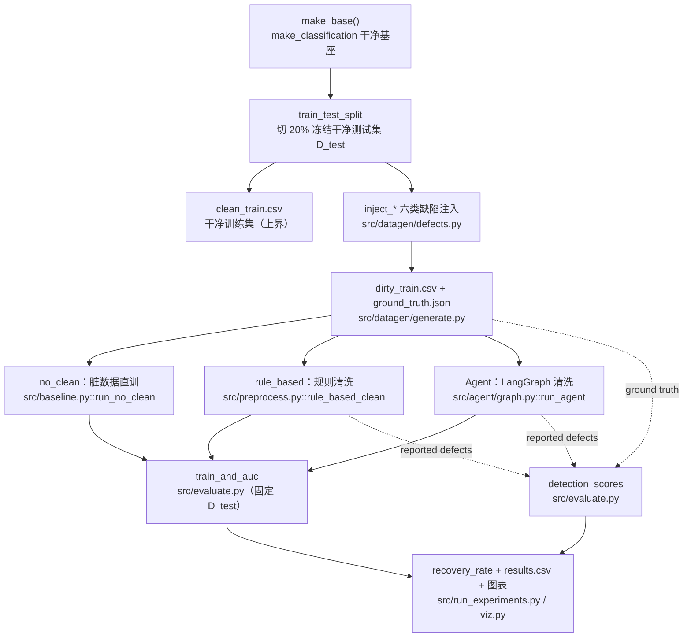
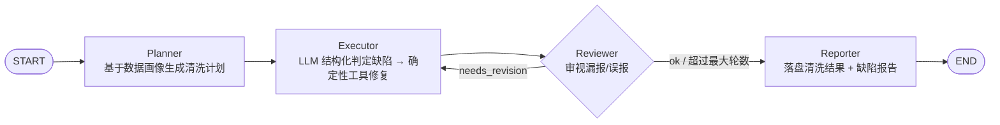
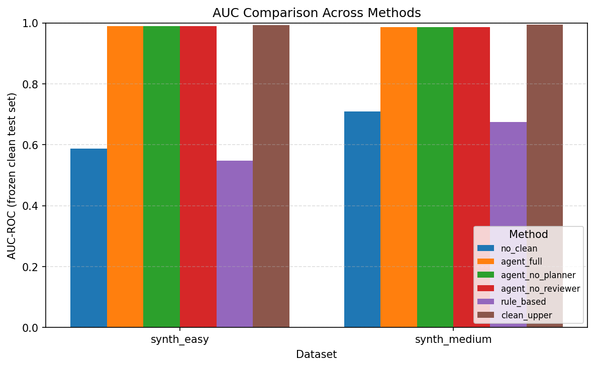
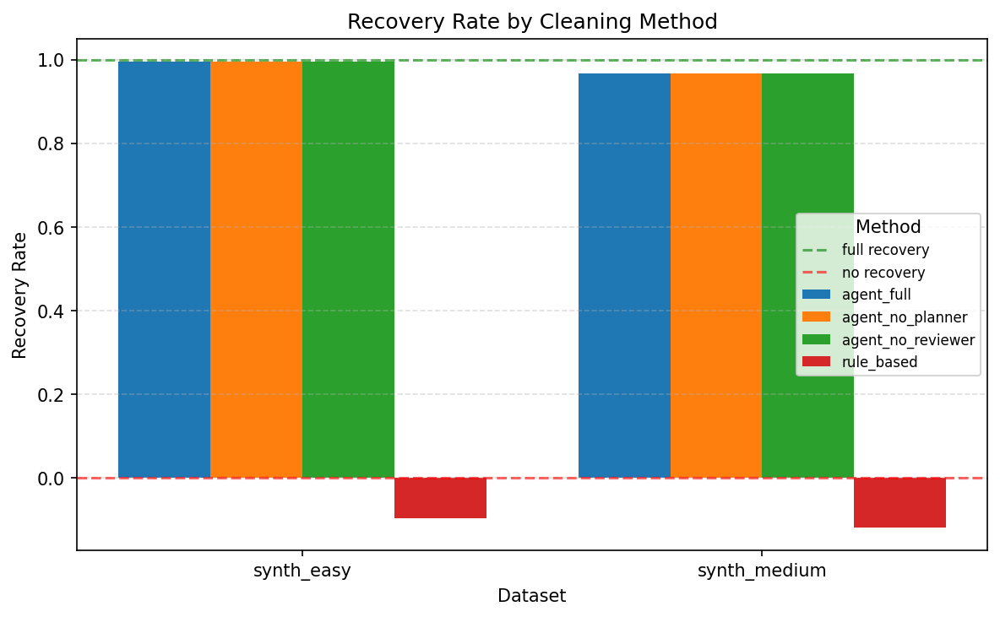
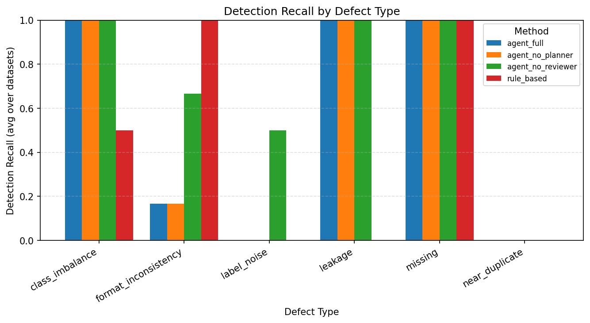

# 数据挖掘课程项目 - 中期进展报告

## 0. 项目基本信息

- **项目名称**：基于脏数据基准的 LLM Data Agent 评估框架
- **项目链接**：[GitHub](https://github.com/Xheng222/data-mining-coursework)
- **小组成员与分工**：

| 姓名 | 学号 | 组内角色 | 开题以来的核心贡献 | 中期之后的分工规划 |
| :--- | :--- | :--- | :--- | :--- |
| 张奕恒 | 3120250939 | 基线与测试 | 测试基线/分支 base 规划（`feature/baseline`、`feature/tests`）、github 仓库维护、协调开发 | 人类 baseline 对比，仓库维护 |
| 张子硕 | 3120250940 | Agent 架构 | LangGraph 状态机装配、CLI 入口、消融开关拓扑（`feature/agent`） | 调优 Agent，扩展 prompt 策略消融 |
| 郭荆 | 3220251337 | Agent 算法 | Planner/Executor/Reviewer/Reporter 节点、确定性工具与稳健 LLM 调用（`feature/agent`） | 提升缺陷检测召回，引入新检测信号 |
| 吴梦硕 | 3120250988 | 数据工程 | 合成数据生成与六类缺陷注入、ground-truth（`feature/datagen`） | 接入 CleanML 真实数据集 |
| 毛凯 | 3220251523 | 评测与实验 | Detection/Recovery 指标、端到端实验编排与可视化（`feature/evaluate`、`feature/experiments`） | 全量消融实验，绘制定量图表 |

---

## 1. 项目概述与当前状态

### 1.1. 中期里程碑达成情况

- **计划目标**：第 9-10 周完成三层数据集与基线，第 10-11 周搭建 Agent 核心框架并在单数据集跑通，第 12 周给出初步结果与消融进展。
- **实际达成**：进度符合计划且核心闭环已跑通。第一层合成数据（六类缺陷 + ground truth）、评测框架（Detection + Recovery）、两类基线、LangGraph Agent 已全部实现并集成；端到端实验在两个难度梯度的合成数据集上完整跑通，产出了 no-clean / rule-based / Agent（含 Reviewer、Planner 两个消融维度）的定量对比与缺陷分型检测结果。第二层 CleanML 与第三层 Kaggle、人类 baseline 按计划按计划于终期冲刺开展。

### 1.2. 代码仓库状态审计

- **提交统计**：总 commit 数 **33**，开题后新增 **29**。
- **分支与协作方式**：采用 **6 个功能 Feature Branch** 并行开发，全部从同一“接口契约”基线派生，完成开发后合并入 `main`，形成清晰的分叉-汇合提交图：

  ```text
  *   fix(tests): 修正集成后两处断言
  *   Merge feature/tests
  |\
  | * test(...): 测试套件 3 提交
  *   Merge feature/experiments
  |\
  | * feat(run_experiments / viz): 2 提交
  *   Merge feature/agent
  |\
  | * feat(agent): 状态/工具、prompt、节点、图装配 4 提交
  *   Merge feature/baseline
  |\
  | * feat(preprocess / baseline): 2 提交
  *   Merge feature/evaluate
  |\
  | * feat(evaluate): train_and_auc、detection 2 提交
  *   Merge feature/datagen
  |\
  | * feat(datagen): 基座、缺陷、编排 4 提交
  *   chore(scaffold): 项目骨架与跨模块接口契约
  ```

  并行可行的关键：先在定义好所有跨模块数据格式（缺陷/检测 schema、`DatasetBundle`、`recovery_rate` 公式），各分支只动各自文件，因此有利于并行开发。

- **当前仓库目录结构**：

  ```text
  ├── README.md              # 环境配置 + 一键复现命令
  ├── pyproject.toml         # 依赖（uv 管理）
  ├── configs/midterm.yaml   # 实验配置：数据集 / 方法 / 消融
  ├── src/
  │   ├── contracts.py       # 跨模块契约：数据类、缺陷与检测 schema、recovery_rate 公式
  │   ├── datagen/           # 合成数据 + 六类缺陷注入（base/defects/generate）
  │   ├── preprocess.py      # 规则化清洗步骤（缺失填充/去重/泄漏列剔除/格式统一）
  │   ├── baseline.py        # no_clean / rule_based / clean_upper 三基线 + CLI
  │   ├── agent/             # LangGraph Agent：state/tools/prompts/nodes/graph
  │   ├── core_model.py      # Agent 命令行入口（含消融开关）
  │   ├── evaluate.py        # Detection(P/R/F1) 与 Recovery Rate
  │   ├── run_experiments.py # 端到端实验编排
  │   └── viz.py             # 结果可视化
  ├── tests/                 # pytest：契约/数据/评测/基线/Agent
  ├── data/                  # 合成数据（可由代码重新生成，未入库）
  └── results/               # 指标 CSV、汇总 JSON、图表 PNG
  ```

---

## 2. 数据工程与审计落地

本项目第一层数据为主动注入缺陷的合成数据，缺陷规模与位置均有 ground truth，因此审计体现为：注入时记录真值，再用代码反查注入是否生效、规模是否符合设定。下表以 `synth_medium`（脏训练集 4756 行 × 32 特征）为例，列出经代码验证的缺陷规模。

### 2.1. 原始数据审计反馈

| 数据问题 | 量化规模（synth_medium，代码验证） | 注入/检测方案（精确到文件/函数） | 处理后效果 |
| :--- | :--- | :--- | :--- |
| 数据泄漏 | 2 个泄漏列（`leak_0`、`leak_1`，由 `target` 线性变换加噪生成） | `src/datagen/defects.py::inject_leakage`；检测见 `src/agent/nodes.py` Executor | Agent 检出召回 **1.0**，剔除后下游 AUC 由 0.709->0.986 |
| 缺失值 | MAR 机制，5 列共 **4035** 个缺失单元（占比 ≈10%/列） | `inject_missing`（支持 MCAR/MAR/MNAR）；填充见 `src/preprocess.py::rule_based_clean` | 检出召回 1.0；填充后特征可用 |
| 标签噪声 | 翻转 5%，共 **235** 个样本标签被翻转 | `inject_label_noise`（记 `flipped_indices`） | 当前 Agent 与规则法**均漏检**（召回 0，见 [4.3 失败案例 1](#43-实验结果初步诊断与分析) ） |
| 近似重复 | **50** 对样本（复制 + σ=0.01 高斯扰动） | `inject_near_duplicate`（`normalize_pair` 记对） | 当前 Agent 漏检（召回 0，见 [4.3 失败案例 2](#43-实验结果初步诊断与分析) ） |
| 类别不平衡 | 由 4000:4000 欠采样至 4000:706（少数类降到 ≈15%，删 3294 行） | `inject_class_imbalance` | Agent 各配置均检出（召回 1.0） |
| 格式不一致 | 3 列、每列 10% 行混入异构格式（千分位/单位/货币等） | `inject_format_inconsistency` | Agent 部分检出（召回 0.33） |

### 2.2. 数据流与预处理管道



关键协议：`D_test` 在划分时即冻结，全程不参与任何清洗与训练；三类方法都在同一个 `D_test` 上计算 AUC，保证可比。Agent 与规则法只读取 `dirty_train.csv`，不接触 `ground_truth.json` 与 `D_test`。

---

## 3. 基线模型与核心算法实现

### 3.1. 基线模型运行情况说明

- **所选基线方法**：
  - `no_clean`（下界）：脏数据直接训练 XGBoost。
  - `rule_based`：固定规则清洗（缺失均值/众数填充、精确去重、`|Pearson| > 0.95` 剔除疑似泄漏列、object 列数值化），思路对标开题的 `ydata-profiling` 自动建议。
  - `clean_upper`（上界）：干净数据训练。
- **运行环境**：Windows 11 + Python 3.13，下游模型 `xgboost.XGBClassifier`（`n_estimators=200, max_depth=4, lr=0.1, tree_method=hist`）。基线不使用 LLM。
- **复现命令**：

  ```bash
  uv run python -m src.run_experiments --config configs/midterm.yaml --skip-agent   # 仅基线
  uv run python -m src.baseline --dataset data/synthetic/synth_medium --out results/baseline.json
  ```

- **关键输出日志**（全量运行真实片段）：

  ```text
  === 数据集 synth_medium (difficulty=medium, seed=7, n_rows=10000, n_features=30) ===
  [clean_upper] AUC_clean = 0.9953
  [no_clean]    AUC_dirty = 0.7089
  [rule_based]  AUC_rule  = 0.6750   recovery_rate(rule_based) = -0.1184
  [agent_full]  AUC=0.9861  recovery_rate=0.9677  detection_f1=0.2535
  ```

### 3.2. 核心进阶算法开发进度

**核心模块设计**：LangGraph 状态机 Data Agent，底层 DeepSeek（使用 OpenAI 兼容接口）。



设计要点：
- **职责分离**：LLM 只负责“依据数据画像（缺失率、重复对、与 target 相关性、类别分布、格式可疑列）做诊断”，真正的修复由 `tools.py` 的确定性 pandas 函数执行，保证可复现、可审计。
- **消融在建图阶段生效**（非运行期跳过）：`use_planner=False` 时 START 直连 Executor；`use_reviewer=False` 时去掉反思回路。
- **三种 prompt 策略**：zero-shot / few-shot / CoT，通过在提示尾部追加策略指令切换。
- **稳健性**：LLM 调用失败或 JSON 解析失败时退化为基于画像的启发式判断，保证整体无故障运行；仅当缺少 `DEEPSEEK_API_KEY` 时抛出明确错误。

**开发进度核查表**：

| 模块 | 对应文件 | 状态 | 备注 |
| :--- | :--- | :---: | :--- |
| 数据预处理 / 缺陷注入 | `src/datagen/*`、`src/preprocess.py` | 完成 | 六类缺陷 + ground truth，三难度预设 |
| 基线模型 | `src/baseline.py` | 完成 | 三基线 + CLI，可独立运行 |
| 核心进阶算法 | `src/agent/*`、`src/core_model.py` | 完成 | Planner/Executor/Reviewer/Reporter 运行完成 |
| 评测框架 | `src/evaluate.py` | 完成 | Detection(P/R/F1) + Recovery Rate |
| 单元 / 集成测试 | `tests/` | 完成 | 24 passed, 1 skipped（LLM 端到端默认跳过） |

---

## 4. 中期实验结果与阶段性分析

### 4.1. 评估指标与测试集构建

- **测试集**：每个合成数据集预先冻结 20% 干净样本作为 `D_test`，全程不参与清洗/训练；其余 80% 注入六类缺陷成脏训练集。当前评测覆盖 2 个难度梯度数据集（`synth_easy`、`synth_medium`，各 10000 行 × 30 特征）。
- **核心指标**：
  - **Detection**：缺陷检测的 Precision / Recall / F1（分缺陷类型 + micro 平均）。
  - **Recovery Rate**：$\text{RR} = \dfrac{\text{AUC}_{\text{method}} - \text{AUC}_{\text{dirty}}}{\text{AUC}_{\text{clean}} - \text{AUC}_{\text{dirty}}}$，三个 AUC 同源于 `D_test`。RR=1 表示完全恢复到干净数据水平。

### 4.2. 定量对比实验结果

| 方法 | 数据集 | AUC (D_test) | Recovery Rate | Detection P | Detection R | Detection F1 |
| :--- | :--- | :---: | :---: | :---: | :---: | :---: |
| clean_upper（上界） | synth_easy | 0.9922 | — | — | — | — |
| no_clean（下界） | synth_easy | 0.5869 | 0.000 | — | — | — |
| rule_based | synth_easy | 0.5474 | **-0.097** | 0.80 | 0.148 | 0.250 |
| **agent_full** | synth_easy | **0.9901** | **0.995** | 1.00 | 0.185 | 0.313 |
| agent_no_reviewer | synth_easy | 0.9901 | 0.995 | 1.00 | 0.222 | 0.364 |
| agent_no_planner | synth_easy | 0.9901 | 0.995 | 1.00 | 0.185 | 0.313 |
| clean_upper（上界） | synth_medium | 0.9953 | — | — | — | — |
| no_clean（下界） | synth_medium | 0.7089 | 0.000 | — | — | — |
| rule_based | synth_medium | 0.6750 | **-0.118** | 0.75 | 0.145 | 0.243 |
| **agent_full** | synth_medium | **0.9861** | **0.968** | 1.00 | 0.145 | 0.253 |
| agent_no_reviewer | synth_medium | 0.9861 | 0.968 | 1.00 | 0.161 | 0.278 |
| agent_no_planner | synth_medium | 0.9861 | 0.968 | 1.00 | 0.145 | 0.253 |

> 三个 Agent 配置的 AUC/Recovery 在每个数据集上完全一致（小数点后多位相同），故 Detection 精度恒为 1.0（Agent 从不误报）。下表给出分缺陷类型的检测召回，用于消融对比。

分缺陷类型的检测召回（三配置对比）：

| 数据集 | 配置 | leakage | missing | imbalance | format | label_noise | near_dup |
| :--- | :--- | :---: | :---: | :---: | :---: | :---: | :---: |
| synth_easy | agent_full | 1.0 | 1.0 | 1.0 | 0.0 | **0.0** | **0.0** |
| synth_easy | agent_no_planner | 1.0 | 1.0 | 1.0 | 0.0 | **0.0** | **0.0** |
| synth_easy | agent_no_reviewer | 1.0 | 1.0 | 1.0 | 1.0 | **0.0** | **0.0** |
| synth_medium | agent_full | 1.0 | 1.0 | 1.0 | 0.33 | **0.0** | **0.0** |
| synth_medium | agent_no_planner | 1.0 | 1.0 | 1.0 | 0.33 | **0.0** | **0.0** |
| synth_medium | agent_no_reviewer | 1.0 | 1.0 | 1.0 | 0.33 | 1.0 | **0.0** |

**三点核心发现**：

1. **数据泄漏是下游性能的决定性因素**。`no_clean` 在脏数据上 AUC 仅 0.59-0.71，泄漏列在训练期主导模型，但在 `D_test` 上不可得（对齐后为 NaN），导致泛化崩塌。规则法以 `|r|>0.95` 判定泄漏，但加噪后的泄漏列相关系数低于阈值，漏检（召回 0），故 `rule_based` 不仅没救回、反而因盲目填充/去重把 AUC 进一步拉低（Recovery 为负）。Agent 通过对画像推理识别并剔除了泄漏列（召回 1.0），AUC 回到 0.986-0.990。

2. **高 Recovery 不等于高 Detection**。Agent 的 Recovery 高达 0.97-0.99，但 Detection F1 仅 0.25-0.31。原因是它精准修复了影响下游 AUC 的缺陷（泄漏、缺失），却漏掉了对 AUC 影响甚微的缺陷（近似重复、标签噪声）。这说明“下游性能恢复”与“缺陷检出完整性”是两个需要分别评估的维度，这正是本基准设置双指标的价值。

3. **Planner / Reviewer 消融在当前规模下未产生稳定可测的差异**。三种配置（full / 去 Reviewer / 去 Planner）的下游 AUC 与 Recovery 逐位完全相同，说明决定下游性能的关键修复（剔除泄漏、填补缺失）在三种配置下都能完成，与是否规划、是否反思无关。检测层面：去掉 Planner 与 full 的分类型召回逐项相同（无任何影响）；去掉 Reviewer 的测试中偶尔多命中一个难检类型（easy 上的 format、medium 上的 label_noise），但这是单一类型的来回摆动，属于 LLM 运行间随机抖动，而非可靠的消融效应，尤其 label_noise 在画像里本无信号，偶发命中更接近模型猜测。结论：要让消融维度产生可测差异，需 (a) 引入更依赖多步推理的更难缺陷，或 (b) 对多个 seed / 多次运行取平均以压过噪声。

> **关于复现**：Agent 调用即使 `temperature=0` 仍存在不同运行间轻微波动，上表的检测数字（尤其 label_noise/format 等难检类型）可能在重跑时小幅变动；三类基线（clean_upper/no_clean/rule_based）与 AUC/Recovery 为确定性结果。终期将以多次运行结果平均上报，以区分真实效应与噪声。





### 4.3. 实验结果初步诊断与分析

| # | 输入（缺陷类型） | 模型输出 | 正确答案 | 失败原因 | 改进方向 |
| :- | :--- | :--- | :--- | :--- | :--- |
| 1 | 标签噪声（synth_medium 翻转 235 个标签，5%） | agent_full / agent_no_planner 召回 0；去 Reviewer 偶有命中但无画像依据（属不稳定猜测） | 应稳定识别存在标签噪声 | 标签噪声在特征统计画像里无直接信号，Executor 仅凭画像无法可靠察觉，命中与否随机 | 在画像中加入交叉验证残差 / confident-learning 信号，让 Agent 有据可依 |
| 2 | 近似重复（synth_medium 50 对，σ=0.01 扰动） | Agent 未报告近似重复（召回 0） | 应识别 50 对近似重复 | 画像的重复检测基于精确/四舍五入判等，带高斯扰动的近似重复不被判为重复，LLM 无信息可用 | 在画像中引入基于距离的近邻相似度检测（如 KNN / MinHash） |

- **总体优缺点小结**：Agent 在“影响下游性能的关键缺陷（泄漏、缺失）”上表现优异，Recovery 接近完全恢复，显著优于规则基线（后者因漏检泄漏甚至产生负收益）；但对“特征统计不可见的缺陷（标签噪声、近似重复）”检测能力为零，检测召回整体偏低。下一步重点是增强数据画像的信息量，把这些隐性缺陷暴露给 Agent。

---

## 5. 后续风险评估与冲刺排期

### 5.1. 风险清单动态调整

- **风险 1（开题：DeepSeek API 不稳定）状态**：未显著发生。本阶段 Agent 调用稳定；已实现 LLM 失败/解析失败的启发式降级，鲁棒性有保障。
- **风险 2（开题：Agent 各配置表现均差、消融无区分度）状态**：部分显现。Agent 与基线的区分度极大，但 Planner/Reviewer 两个消融维度之间目前无稳定可测差异。这正是开题预案要应对的情形，应对如下。
- **新增风险与预案**：
  - *消融维度区分度不足*：当前任务下“关键缺陷（泄漏/缺失）”过于明显，规划/反思与否都能修好。预案：(1) 设计更依赖多步推理的更难缺陷梯度；(2) 多 seed / 多次运行取平均，压过 LLM 噪声后再比较。
  - *Agent 结果非完全确定*：`temperature=0` 下检测层仍有波动。预案：终期对多次运行取平均上报，明确区分真实效应与噪声；基线与 AUC/Recovery 本身确定，不受影响。
  - *检测召回偏低*：标签噪声/近似重复检测召回为 0。预案：扩充数据画像信号，而非改动 Agent 拓扑。
  - *外部数据集接入成本*：第二层 CleanML 与第三层 Kaggle 尚未接入，存在 schema 适配与下载成本。预案：复用现有 `train_and_auc`/`detection_scores` 接口，仅写数据加载适配层；CleanML 已自带脏/净配对，可直接计算 Recovery。

### 5.2. 终期冲刺详细排期（第 13 周 - 第 16 周）

| 周次 | 核心任务目标 | 责任人 | 预期交付物 / 验收标准 |
| :--- | :--- | :--- | :--- |
| **第 13 周** | 增强数据画像（加入 CV 残差、近邻相似度），提升标签噪声/近似重复检测召回；补齐 prompt 策略消融（zero/few/CoT） | 郭荆、张子硕 | 检测召回提升的对比数据；三策略消融初步结果 |
| **第 14 周** | 接入 CleanML 2-3 个数据集，运行全量对比与消融，完成所有定量图表 | 毛凯、吴梦硕 | CleanML 上的 Recovery 表、消融可视化图表 |
| **第 15 周** | 人类 baseline 对比；整理仓库、撰写终期报告、录制 Demo | 张奕恒、全员 | Demo 视频、撰写终期报告 |
| **第 16 周** | 制作答辩 PPT、组内试讲、最终答辩准备 | 全员 | 答辩 PPT、系统演示 Demo |

---

## 6. AI 工具辅助使用记录

| 使用场景 | AI 工具名称 | 具体辅助环节（精确到文件/功能） | 团队审查与纠错说明 |
| :--- | :--- | :--- | :--- |
| 代码编写 | Claude (Claude Code) | 规划和实现统一接口契约，为多分支开发提供基础实现 | 参与规划和审查各接口实现，确认框架完善符合开发规范 |
| 运行时算法 | DeepSeek | 作为 Data Agent 的底层 LLM，执行缺陷诊断 | 诊断结论仅作建议，实际修复由确定性工具执行，结果可复现可审计 |
| 报告撰写 | Claude (Claude Code) | 参与整理实验结果与中期报告表述润色 | 所有指标、规模数字均来自代码运行的真实输出，非示例 |

---

> **中期自查清单**
>
> **代码仓库**
> - [x] 仓库设公开 + 近两周有真实 commit（25 个开题后新增提交）
> - [x] README 含环境配置与一键复现命令，可独立运行
> - [x] 所有组员至少 1 次 commit
>
> **数据与实验**
> - [x] 数据审计表已填，每条缺陷给出量化规模
> - [x] 基线已完整跑通，报告含真实终端日志
> - [x] 进阶模型与基线已定量对比（有数字）
> - [x] 误差分析含 2 个具体失败案例（标签噪声、近似重复）
>
> **报告完整性**
> - [x] 成员分工与开题后贡献写入分工表
> - [x] 冲刺排期精确到周、责任人明确
> - [x] AI 工具使用如实填写
