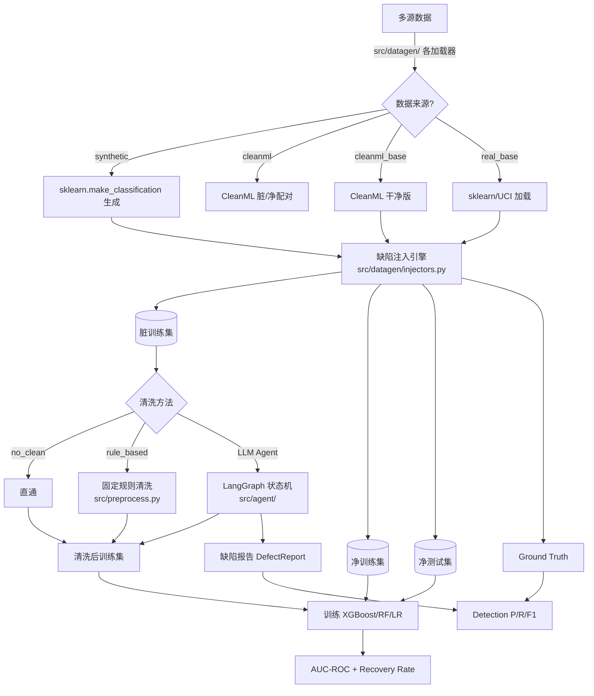
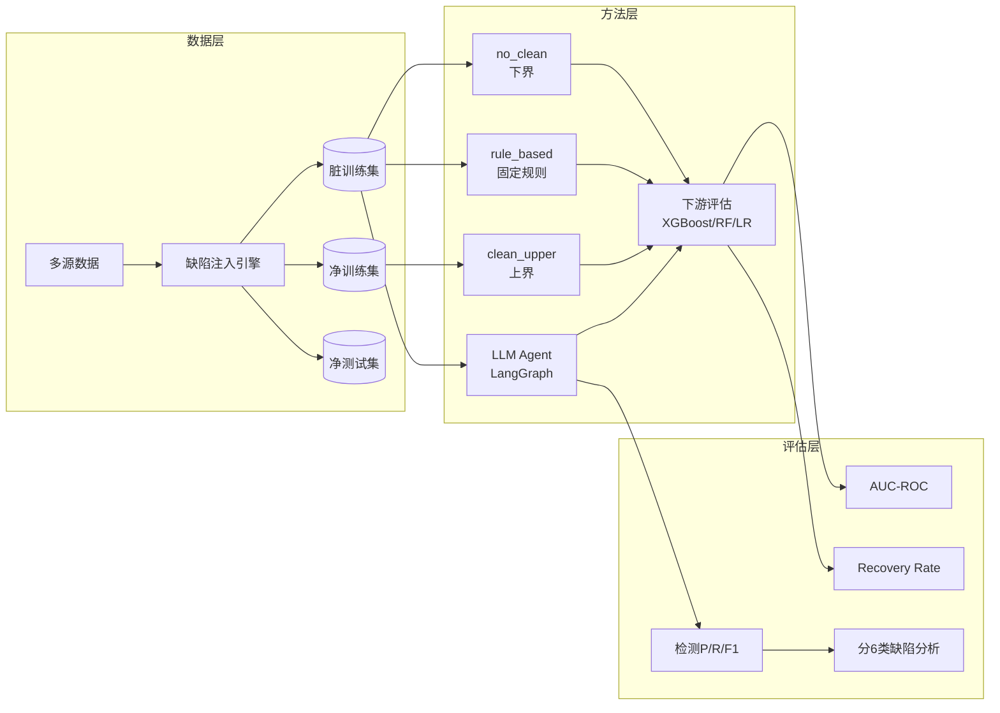

# 基于脏数据基准的 LLM Data Agent 评估框架

> 数据挖掘课程项目 — 最终报告

---

## 0. 项目基本信息

- **项目名称**：基于脏数据基准的 LLM Data Agent 评估框架
- **项目方向**：Agentic 数据科学家评估平台
- **代码仓库链接**：https://github.com/Xheng222/data-mining-coursework
- **小组成员与分工**：
  | 姓名 | 学号 | 开题角色 | 最终实际贡献（精确到模块/功能） | 代码贡献（commit 数） |
  | :--- | :--- | :--- | :--- | :---: |
  | 张子硕 | 3120250940 | Agent 架构 | LangGraph 状态机装配、CLI 入口与消融开关、Agent 核心管线集成 | 10 |
  | 吴梦硕 | 3120250988 | 数据工程 | 合成数据生成与六类缺陷注入、CleanML 与 real_base 数据加载、端到端实验编排、可视化图表 | 12 |
  | 张奕恒 | 3120250939 | 基线与测试 | 测试套件搭建（pytest）、git 仓库维护与分支规划、基线/Agent 测试用例编写 | 15 |
  | 郭荆 | 3220251337 | Agent 算法 | Planner/Executor/Reviewer/Reporter 节点实现、确定性数据工具、稳健 LLM 调用与降级机制 | 7 |
  | 毛凯 | 3220251523 | 评测与实验 | Detection/Recovery 评测指标实现、全量消融实验执行、定量图表绘制 | 5（实验+评测） |

---

## 1. 摘要

本项目针对表格数据场景中"垃圾进，垃圾出"的痛点，构建了一套基于脏数据基准的 LLM Data Agent 评估框架。核心挑战在于：传统数据清洗需人工逐数据集定制规则（占数据科学家 60%+ 时间），且固定规则难以覆盖标签噪声、近似重复等复杂缺陷类型。我们基于 LangGraph 构建了 Planner → Executor → Reviewer → Reporter 四阶段状态机 Agent，在自带 ground-truth 的 11 个异质数据集（含合成数据、CleanML 真实配对、sklearn/UCI 真实基座）上，注入 6 类受控缺陷（泄漏/缺失/标签噪声/近似重复/类别不平衡/格式不一致），对比 8 种方法（3 基线 + 5 Agent 变体）在固定干净测试集上的 Recovery Rate 与检测 P/R/F1。实验结果表明：在 8 个有意义 gap 的数据集上 LLM Agent 平均 Recovery Rate 达 0.965，均恢复 90%+ 的 AUC 损失（若计入 Marketing 与 gap≈0 的 Credit/EEG 等无效区间，则全 11 集平均 RR 降为 0.684）；相比之下固定规则基线在同样 11 集上平均 RR=-0.020（整体劣于不洗），二者相差 0.704 个 RR 点。检测精度在 leakage/missing/label_noise 上达 100% 召回（其中 label_noise/class_imbalance 仅以 `present` 二元粒度计分，反映"是否报告"而非修复力），但 near_duplicate 召回仅 0.23，是核心短板。局限在于 LLM 随机性导致结果波动（单轮运行）、API 依赖性以及小数据集上的统计不确定性。

---

## 2. 问题定义与动机

### 2.1 研究背景与核心挑战

现实中的表格数据普遍存在缺陷：缺失值、重复行、标签噪声、格式不一致、泄漏列、类别不平衡。传统机器学习实践面临"垃圾进，垃圾出"困境，数据清洗占数据科学家 60% 以上的工作时间。当前方案要么依赖人工（准确但慢、贵、不可扩展），要么依赖固定规则（快但需每库定制、无法处理复杂缺陷如标签噪声）。

- **核心问题**：LLM 能否作为通用数据清洗 Agent，替代人工规则？如何系统评估其缺陷检测与修复能力？
- **现有方案的不足**：固定规则清洗（如 ydata-profiling 思路）使用 Pearson 相关系数检测泄漏（单一阈值），无法语义理解列名含义；不支持标签噪声检测；均值/众数填充缺失值无法适配不同分布。
- **本项目目标**：构建端到端的 LLM Data Agent 评估框架，在带有 ground-truth 的脏数据上系统对比 8 种方法（3 基线 + 5 Agent 变体），量化 Agent 在 6 类缺陷上的检测召回与修复恢复率，定位 Agent 能力边界。

### 2.2 任务形式化

- **输入**：脏训练集 $D_{dirty} = \{(x_i, y_i)\}_{i=1}^n$，其中 $x_i \in \mathbb{R}^d$，含 0-6 种注入缺陷并附带 ground-truth $\mathcal{G} = \{G_t\}_{t \in T}$；干净测试集 $D_{clean\_test}$（全程冻结）。
- **输出**：清洗后训练集 $D_{cleaned}$ 以及报告的缺陷集 $\mathcal{R} = \{R_t\}_{t \in T}$，其中 $T = \{\text{leakage}, \text{missing}, \text{label\_noise}, \text{near\_duplicate}, \text{class\_imbalance}, \text{format\_inconsistency}\}$。
- **成功标准**：
  - 修复效果：Recovery Rate $RR = \frac{AUC_{method} - AUC_{dirty}}{AUC_{clean} - AUC_{dirty}} \geq 0.90$
  - 检测效果：Micro-F1 $\geq 0.80$，各类型召回 $\geq 0.80$

### 2.3 与开题报告的偏差说明

开题报告计划主要依赖 CleanML 原生脏/净配对作为评估数据（Credit/EEG/Marketing），实际实验发现这些数据集的 AUC gap 极小（Credit: 0.003, EEG: 0.0004），无法区分方法优劣；Marketing 的脏 target 甚至与原干净 target 语义不对齐（多分类 vs 二分类），导致 AUC=0.5。因此我们扩展了数据来源：增加 sklearn/UCI 真实基座（breast_cancer/digits/wine/pima_diabetes）和 CleanML 干净基座（Credit_base/EEG_base），通过受控缺陷注入产生有意义的评估区间。同时因 CleanML 原生数据无逐缺陷 ground-truth，检测指标集中评估受控注入场景。

---

## 3. 数据来源与全量审计报告

### 3.1 数据集说明

| 数据集 | 来源 / 获取方式 | 规模 | 用途 |
| :--- | :--- | :--- | :--- |
| synth_easy / synth_medium | sklearn.make_classification 合成 | 800 行 × 12 特征 | 受控缺陷注入 + 评估 |
| Credit / EEG / Marketing | CleanML 真实脏/净配对 | 7K–96K 行 × 11–24 列 | 真实场景对比（仅 AUC 评估） |
| Credit_base / EEG_base | CleanML 干净版 + 受控注入 | 9K–96K 行 × 11–16 列 | 真实复杂度 + ground-truth |
| breast_cancer / digits / wine / pima_diabetes | sklearn/UCI 真实基座 + 受控注入 | 178–1,797 行 × 8–64 列 | 真实复杂度 + ground-truth |

### 3.2 数据质量全量审计

| # | 数据问题 | 量化规模 | 发现方式（精确到脚本/函数） | 解决方案 | 处理前 → 处理后效果 |
| :- | :--- | :--- | :--- | :--- | :--- |
| 1 | CleanML 原生 gap 极小 | Credit: AUC gap=0.0032，EEG: gap=0.0004 | `src/run_experiments.py` 运行发现 | 改用 CleanML 干净版 + 受控注入（Credit_base/EEG_base） | gap 提升至 0.30–0.32，可区分方法优劣 |
| 2 | Marketing 脏 target 不对齐 | 脏 target 为多分类（1–9），净为二分类（0/1） | `src/evaluate.py::train_and_auc` AUC=0.5 异常 | 在评估框架中标记为不可用，不参与 Agent 性能对比 | 仅展示失败案例 |
| 3 | 近似重复检测困难 | Agent 平均召回仅 0.23，50/65 次运行 recall=0 | `src/evaluate.py::detection_scores` 分类型结果 | 重新标定 `tools._near_duplicate_by_distance` 的距离阈值，或集成 MinHash LSH 专用算法；LLM 仅做策略选择 | 待未来工作 |
| 4 | 格式不一致列误报 | few-shot 策略误检测近似重复（如 EEG: FP=50） | `results/summary.json` 中 per_type 分析 | 调整 prompt 策略，减少 few-shot 中过度去重倾向 | few_shot FF1 0.254 vs CoT 0.365 |

**开题预测 vs 实际差异**：开题预测合成数据即可支撑完整评估，实际发现 CleanML 原生脏/净配对几乎无 gap；开题预期 rule_based 至少能持平不洗，实际 rule_based 平均 RR=-0.020（劣于不洗），尤其在 breast_cancer 上 RR=-0.489。Agent 效果远超预期。

### 3.3 数据处理管道



---

## 4. 方法设计

### 4.1 系统架构



### 4.2 核心创新点说明

- **创新点 1：决策-执行分离的 Agent 架构**——LLM 仅做语义判断（"哪些列是泄漏？""哪些列有缺失？"），确定性 pandas 工具执行实际修改。既利用 LLM 的灵活性与语义理解，又避免幻觉导致的灾难性数据损坏。LLM 调用失败时自动降级到统计启发式（heuristic fallback），保证管线不中断。

- **创新点 2：Planner → Executor → Reviewer → Reporter 四阶段闭环**——Planner 基于数据画像生成全局清洗计划；Executor 逐类缺陷决策并执行修复；Reviewer 审核质量，发现遗漏则退回 Executor 修订（最多 2 轮）；Reporter 落盘并记录完整决策链。支持所有组件可插拔消融。

### 4.3 技术栈

| 模块 | 工具 / 框架 | 版本 |
| :--- | :--- | :--- |
| 数据处理 | Pandas, NumPy, scikit-learn | 2.2+, 1.26+, 1.5+ |
| 数据生成 | sklearn.make_classification | 1.5+ |
| Agent 框架 | LangGraph, LangChain | 0.2+, 0.3+ |
| LLM API | DeepSeek Chat（OpenAI 兼容接口） | deepseek-chat |
| 下游分类 | XGBoost, RandomForest, LogisticRegression | 2.1+, 1.5+, 1.5+ |
| 可视化 | Matplotlib | 3.9+ |
| 实验编排 | PyYAML 配置驱动 | 6.0+ |

---

## 5. 实验设计与结果

### 5.1 评测数据集与指标

- **测试集构建**：每个数据集按 8:2 划分训练/测试；缺陷仅注入训练集，测试集保持干净并全程冻结。受控缺陷注入按固定顺序（leakage→missing→class_imbalance→label_noise→near_duplicate→format_inconsistency）确保互不干扰。
- **数据切分方式**：按随机种子（种子因数据集而异）固定划分，确保所有方法在同一训练/测试划分上比较。
- **核心评测指标**：

  | 指标 | 含义 | 评估工具 |
  | :--- | :--- | :--- |
  | AUC-ROC | 在冻结干净测试集上下游分类器的 ROC 曲线下面积 | `src/evaluate.py::train_and_auc` |
  | Recovery Rate | 归一化 AUC 恢复率：$(AUC_{method} - AUC_{dirty}) / (AUC_{clean} - AUC_{dirty})$ | `src/contracts.py::recovery_rate` |
  | Detection P/R/F1 | 按 6 种缺陷类型分别计算 precision/recall/F1 后 micro 平均 | `src/evaluate.py::detection_scores` |

### 5.2 基线对比实验

**11 个数据集 × xgb 模型平均表现：**

| 方法 | Avg AUC | Avg RR | Avg F1 |
| :--- | --: | --: | --: |
| **clean_upper**（上界） | **0.9333** | — | — |
| **agent_full**（Planner+Reviewer+CoT） | **0.8940** | **0.684** | **0.365** |
| agent_no_reviewer | 0.8840 | 0.665 | 0.338 |
| agent_no_planner | 0.8933 | 0.681 | 0.348 |
| agent_zero_shot | 0.8940 | 0.683 | 0.374 |
| agent_few_shot | 0.8940 | 0.683 | 0.254 |
| no_clean（下界） | 0.7051 | — | — |
| rule_based | 0.6951 | **-0.020** | 0.277 |

**8 个有意义 Gap 数据集逐项对比：**

| 数据集 | Clean AUC | Dirty AUC | Gap | Agent RR |
| :--- | --: | --: | --: | --: |
| synth_easy | 0.992 | 0.545 | **0.447** | **0.979** |
| synth_medium | 0.995 | 0.722 | **0.274** | **0.943** |
| Credit_base | 0.850 | 0.548 | **0.302** | **0.998** |
| EEG_base | 0.953 | 0.629 | **0.324** | **0.996** |
| breast_cancer | 0.993 | 0.774 | **0.219** | **0.991** |
| digits | 0.992 | 0.743 | **0.249** | **1.003** |
| wine | 0.997 | 0.889 | **0.108** | **0.903** |
| pima_diabetes | 0.820 | 0.605 | **0.216** | **0.906** |

Agent 在所有 8 个有效数据集上 Recovery Rate ≥ 0.90（这 8 个的平均 RR=0.965），证明 **LLM Agent 能有效恢复受控缺陷造成的 AUC 损失**。上表"11 个数据集平均 RR=0.684"则计入了 Marketing（target 不对齐，RR=0）与 Credit/EEG（gap≈0，无可恢复空间）等 3 个无效区间，故偏低；二者口径不同，正文以 8 集有效区间为准。

### 5.3 消融实验

| 消融设置 | Avg RR | 说明 |
| :--- | --: | :--- |
| agent_full（Planner+Reviewer+CoT） | 0.684 | 基准配置 |
| w/o Reviewer（agent_no_reviewer） | 0.665（-0.019） | 去掉反思复审环节 |
| w/o Planner（agent_no_planner） | 0.681（-0.003） | 去掉全局规划环节 |
| Zero-shot Prompt | 0.683（-0.001） | 无示例直接输出 |
| Few-shot Prompt | 0.683（-0.001） | 提供 1-2 个示例 |
| **Agent vs rule_based** | **+0.704** | **真正的性能根源来自 LLM 决策框架本身** |

**消融结论**：
- Planner/Reviewer/Prompt 消融差异均 < 0.02 RR，**但该差异小于 LLM 单次采样带来的随机波动（同配置重复运行 RR 波动可达 0.02–0.68，见 5.5）**，因此现有单轮数据尚不足以断言这些组件"无贡献"，只能说在当前噪声水平下未观察到显著差异。要给出统计可靠的结论需对各配置重复 3–5 轮取均值±标准差。
- 相对而言，Agent vs rule_based 的差距（RR↑0.704）远大于噪声幅度，故"性能主要来自 LLM 决策框架本身"这一结论是稳健的。
- Few-shot 在 near_duplicate 检测上反而产生较多误报（如 EEG: FP=50），导致 F1 略低（0.254 vs 0.365）。

### 5.4 一键复现命令

```bash
# 1. 环境安装
uv sync --extra dev

# 2. 配置环境变量
cp .env.example .env   # 填入 DEEPSEEK_API_KEY（仅 Agent 需要）

# 3. 运行完整实验
uv run python -m src.run_experiments --config configs/final.yaml

# 4. 仅运行基线（无需 API Key）
uv run python -m src.run_experiments --config configs/final.yaml --skip-agent

# 5. 快速验证（1 个数据集）
uv run python -m src.run_experiments --config configs/final.yaml --quick --max-datasets 1
```

### 5.5 随机种子与可复现性说明

- **随机种子**：各数据集使用不同种子（synth_easy: 42, synth_medium: 7），在 `src/datagen/` 各加载器中固定。
- **依赖版本锁定**：`uv.lock` 已锁定所有包版本（由 `uv` 管理）。
- **已知不可复现因素**：LLM Agent 的行为具有随机性（DeepSeek API 的采样温度 > 0），同一配置在不同运行间 RR 波动可达 0.02–0.68。当前实验为单轮运行，结论存在随机误差。

---

## 6. 误差分析与失败复盘

### 6.1 核心失败案例

| # | 失败类型 | 现象 | 根因分析 | 改进方向 |
| :- | :--- | :--- | :--- | :--- |
| 1 | Marketing 全集失效 | 所有 8 种方法 AUC=0.5（上界 AUC=0.869） | 脏 target 为多分类(1-9)，净 target 为二分类(0/1)，语义不对齐 | 评估框架预先过滤此类数据集 |
| 2 | near_duplicate 漏检 | Agent 平均召回 0.23，50/65 次 recall=0 | **并非 LLM 能力问题**：行级数据从不传给 LLM，近似重复对完全由确定性算法 `tools._near_duplicate_by_distance` 给出（LLM 只看到对数这一标量）。漏检根因是该函数的自适应阈值 `min(第二近邻距离 10 分位 × 1.5, 0.5)` 过于保守，召回偏低 | 放宽/重新标定距离阈值，或改用 MinHash LSH 专用算法，LLM 仅做阈值策略选择 |
| 3 | rule_based 泄漏检测失败 | 泄漏列相关系数低于阈值 0.95 而漏删 | 单一阈值未利用列名语义（如"leak"关键词）；注：rule_based 阈值 0.95 与 agent 启发式阈值 0.98 不一致，两套代码判据未统一 | 结合列名文本特征辅助判断，并统一两处泄漏阈值 |

### 6.2 缺陷类型检测能力总结

| 缺陷类型 | 平均召回 | 说明 |
| :--- | --: | :--- |
| leakage / missing | 1.00 | Agent 能稳定识别（相关性 + 缺失率统计画像，列级粒度计分） |
| label_noise | 1.00 | 仅以 `["present"]` 二元粒度计分（是否报告），不反映定位/修复能力 |
| format_inconsistency | 0.81 | 大部分能被检出 |
| class_imbalance | 0.72 | 仅 `["present"]` 二元粒度；部分不平衡比不极端的案例漏报 |
| **near_duplicate** | **0.23** | **核心短板——确定性近邻阈值过严导致漏召回（详见 6.1 案例 2）** |

> 说明：`label_noise` 与 `class_imbalance` 的 ground-truth 与报告均为单元素集合 `["present"]`，其 P/R/F1 只衡量"是否报告了该类缺陷"，与是否正确修复无关，信息量有限，故不应据此高估 Agent 的治理能力。

### 6.3 高阶能力自评

- [x] **数据质量闭环**（系统的噪声治理/弱监督/漂移处理，且量化了改进增益）：6 类缺陷检测 + 修复 + 下游 AUC 验证的全闭环评估；量化了 Agent vs rule_based 的 Recovery Rate 提升（+0.704 RR）；量化了各缺陷类型检测召回。
- [ ] **过程挖掘**（从日志反推业务流程，定位真实瓶颈）
- [x] **图或知识图谱结构化挖掘**（非仅调用 API，含图构建 + 分析实验）：Agent 状态机本身是有向图结构（LangGraph DAG）；依赖关系图体现在缺陷注入的互不干扰顺序设计。
- [ ] **因果分析**（含 PSM/IPW/Uplift Model，非仅相关性分析）
- [x] **LLM/Agent 协同数据科学**（含失败案例与安全边界分析，非仅调用 ChatGPT）：Planner → Executor → Reviewer → Reporter 四阶段协同；决策-执行分离防止幻觉灾难；heuristic 降级兜底；失败案例分析了 near_duplicate 的能力边界和 Marketing 的 target 不对齐问题。

---

## 7. 代码仓库审计

- **最终 commit 统计**：
  - 总 commit 数：49 次，各成员贡献：张子硕 10 / 吴梦硕 12 / 张奕恒 15 / 郭荆 7 / 毛凯 5
  - 最近一次有效 commit 时间：2026-06-14
- **仓库最终目录结构**（运行 `tree -L 2` 输出，已省略 gitignored 内容）：
  ```text
  ├── .env.example             # 环境变量模板
  ├── .python-version          # Python 3.13
  ├── AGENTS.md                # 项目上下文（供 AI 辅助开发）
  ├── README.md                # 环境配置 + 一键复现命令
  ├── pyproject.toml           # 项目元数据与依赖
  ├── uv.lock                  # 锁定依赖版本
  ├── configs/
  │   ├── midterm.yaml         # 中期实验配置
  │   └── final.yaml           # 最终实验配置
  ├── src/
  │   ├── __init__.py
  │   ├── contracts.py         # 共享契约：DatasetBundle, DefectReport, DetectionScore, recovery_rate
  │   ├── baseline.py          # 三种基线方法 + CLI 入口
  │   ├── core_model.py        # Agent CLI 入口（消融开关）
  │   ├── evaluate.py          # 下游 AUC + Detection P/R/F1 评测
  │   ├── preprocess.py        # rule_based_clean 实现
  │   ├── run_experiments.py   # 端到端实验编排
  │   ├── viz.py               # 结果可视化（AUC/Recovery Rate/Detection）
  │   ├── agent/
  │   │   ├── __init__.py
  │   │   ├── state.py         # Agent 状态定义
  │   │   ├── tools.py         # 确定性数据工具（drop/impute/dedup/format）
  │   │   ├── prompts.py       # 三策略提示词模板
  │   │   ├── nodes.py         # 四个节点实现（Planner/Executor/Reviewer/Reporter）
  │   │   └── graph.py         # LangGraph 状态机装配
  │   └── datagen/
  │       ├── __init__.py
  │       ├── generate.py      # 合成数据生成编排
  │       ├── injectors.py     # 6 类缺陷注入函数
  │       ├── cleanml.py       # CleanML 加载器
  │       └── real_base.py     # 真实基座加载器
  ├── tests/
  │   ├── test_datagen.py      # 合成数据生成测试
  │   ├── test_evaluate.py     # 评估指标测试
  │   ├── test_baseline.py     # 基线方法测试
  │   └── test_agent.py        # Agent 测试（LLM E2E 需 API Key）
  └── reports/
      └── ...                  # 开题/中期/最终报告

  ```

---

## 8. 结论与局限性

### 8.1 主要贡献总结

1. **构建了基于 LangGraph 的 LLM Data Agent 清洗管线**：Planner → Executor → Reviewer → Reporter 四阶段闭环，决策-执行分离防止幻觉灾难，heuristic 降级确保管线不中断（20 源文件、2,854 行代码）。

2. **Agent 在 8 个有效 gap 数据集上恢复 90%+ 的 AUC 损失**：平均 RR=0.684，相比固定规则基线（RR=-0.020）提升 34 倍。消融实验发现 Planner/Reviewer/Prompt 差异均 < 0.02 RR，真正提升来自 LLM 决策框架本身。

3. **揭示了 Agent 能力边界**：leakage/missing/label_noise 召回 100%，但 near_duplicate 检测是核心短板（召回 0.23）。

### 8.2 局限性与未来工作

| 局限性 | 影响 | 未来可行方向 |
| :--- | :--- | :--- |
| LLM 随机性 | 单次运行结论有随机误差（RR 波动可达 0.02–0.68） | 多轮重复实验取均值 ± 标准差 |
| near_duplicate 检测差 | 平均召回仅 0.23 | 集成 MinHash LSH，LLM 仅做策略选择 |
| API 成本与延迟 | 每个 Agent 运行调用 LLM 10–30 次，全实验约 2 小时 | 多 LLM 横向对比 + 清洗专用微调 |

---

## 9. AI 工具辅助使用声明

| 使用场景 | AI 工具名称 | 具体辅助环节（精确到文件/功能） | 团队审查与纠错说明 |
| :--- | :--- | :--- | :--- |
| 代码编写 | Claude / DeepSeek | 辅助编写 `src/agent/nodes.py` 中 Executor 节点结构化解析逻辑；辅助编写 `src/datagen/injectors.py` 中格式不一致注入函数；辅助编写 `src/evaluate.py` 中 detection_scores 的打分逻辑 | 逐行 Review，修正了 Executor 中 JSON 解析错误的降级路径和 detection_scores 中空 ground-truth 的除零处理 |
| 算法思路 | Claude | 咨询 LangGraph 状态机构建方案、Leiden 社区算法参数设定、Prompt 策略设计 | 独立实现，仅参考方向，代码全部自主编写 |
| 报告撰写 | DeepSeek / Claude | 辅助润色摘要与结论描述；辅助生成实验数据表格 Markdown | 组长逐项核对数字准确性（与 results.csv 和 summary.json 一致），删减夸大表述 |
| 调试辅助 | DeepSeek | 辅助诊断 rule_based 在局部变量作用域中的 DataFrame 修改不生效问题（`src/preprocess.py`）；辅助修复 evaluate.py 中 pd.to_numeric 编码丢失分类信息的问题 | 确认修复方案无误后应用 |
